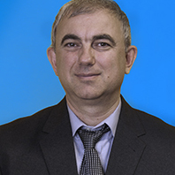

## Manik Varma (Microsoft Research India) -  The Extremes of Machine Learning

I will discuss extremely large and extremely small scale machine learning in this talk. I will start by introducing extreme classification – a new area of research focusing on multi-class & multi-label problem involving millions of categories. Extreme classification has opened a new paradigm for thinking about key applications in our industry. I will discuss algorithms for some of these applications and present results on tagging on Wikipedia, product recommendation on Amazon and search and advertising on the Bing search engine. More details can be found on The Extreme Classification Repository at http://manikvarma.org/downloads/XC/XMLRepository.html

In the second part of my talk, I will propose an alternative paradigm for the Internet of Things (IoT) where machine learning algorithms run locally on extremely  resource-constrained edge and endpoint devices without necessarily needing cloud connectivity. This enables many scenarios beyond the pale of the traditional paradigm including low-latency brain implants, precision agriculture on disconnected farms, privacy-preserving smart spectacles, etc. Towards this end, I will discuss developing novel machine learning algorithms that can run on cheap and extremely energy efficient microcontrollers smaller than a grain of rice having just 2 KB RAM with no hardware support for floating point operations. Source code for these algorithms is publicly available as part of Microsoft’s Edge Machine Learning library from https://github.com/Microsoft/EdgeML

 
| *Bio*: Manik Varma is a principal researcher at Microsoft Research India and an adjunct professor of computer science at the Indian Institute of Technology (IIT) Delhi. His research interests lie in the areas of machine learning, computational advertising and computer vision. Classifiers that he has developed have been deployed on millions of devices around the world and have protected them from viruses and malware. His algorithms are also generating millions of dollars on the Bing search engine (up to sign ambiguity). In 2013, he and John Langford coined the term extreme classification and found that they had inadvertently started a new area in machine learning. Today, by happenstance, extreme classification is thriving in both academia and industry with Manik’s classifiers being used in various Microsoft products as well as in the wider tech sector. Manik recently proclaimed “2 KB (RAM) ought to be enough for everybody” prompting the media in the US, India, China, France, Belgium and Singapore to cover his research and compare him to Bill Gates (unfair, Manik’s more handsome!). Manik has been awarded the Microsoft Gold Star award, the Microsoft Achievement award, won the PASCAL VOC Object Detection Challenge and stood first in chicken chess tournaments and Pepsi drinking competitions. He has served as an area chair/senior PC member for machine learning, artificial intelligence and computer vision conferences such as AAAI, CVPR, ICCV, ICML, IJCAI and NIPS and is  serving as an associate editor of the IEEE PAMI journal. Manik is also a failed physicist (BSc St. Stephen's College, David Raja Ram Prize), theoretician (BA Oxford, Rhodes Scholar), engineer (DPhil Oxford, University Scholar) and mathematician (MSRI Berkeley, Post-doctoral Fellow) |  | 

## Geoff Webb (Monash University) -  Learning in a dynamic and ever changing world

The world is dynamic – in a constant state of flux – but most learned models
are static. Models learned from historical data are likely to decline in
accuracy over time.  I will present our recent work on how to address this
serious issue that confronts many real-world applications of machine
learning.  Methodology: we are developing objective quantitative measures of
drift and effective techniques for assessing them from sample data. Theory:
we posit a strong relationship between drift rate, optimal forgetting rate
and optimal bias/variance profile, with the profound implication that the
fundamental nature of a learning algorithm should ideally change as drift
rate changes. Techniques: we have developed the Extremely Fast Decision
Tree, a statistically more efficient variant of the incremental learning
workhorse, the Very Fast Decision Tree.

 
| *Bio*: Geoff Webb is a leading data scientist. He is Director of the Monash
University Centre for Data Science and a Technical Advisor to data science
startups FROOMLE and BigML Inc. The latter have incorporated his best of
class association discovery software, Magnum Opus, as a core component of
their advanced Machine Learning service. He developed many of the key
mechanisms of support-confidence association discovery in the late 1980s.
His OPUS search algorithm remains the state-of-the-art in rule search. He
pioneered multiple research areas as diverse as black-box user modelling,
interactive data analytics and statistically-sound pattern discovery.  He
has developed many useful machine learning algorithms that are widely
deployed.  He was editor in chief of the premier data mining journal, Data
Mining and Knowledge Discovery from 2005 to 2014. He has been Program
Committee Chair of the two top data mining conferences, ACM SIGKDD and IEEE
ICDM, as well as General Chair of ICDM. He is an IEEE Fellow. His many
awards include the inaugural Australian Museum Eureka Prize for Excellence
in Data Science. |  | 

## Sašo Džeroski (Jozef Stefan Institute and the Centre of Excellence for Integrated Approaches in Chemistry and Biology of Proteins, Ljubljana, Slovenia) - Multi-target prediction on data streams

Starting from tree-based regression methods for data streams, we have developed a number of approaches for on-line multi-target prediction. These cover different multi-target prediction tasks such as multi-target regression, multi-label classification and hierarchical versions of these tasks. These also cover a range of tree-based methods, including individual decision trees, option trees and tree ensembles (bagging and random forests). Finally, we have recently also addressed the task of semi-supervised multi-target prediction on data streams. The talk will give an overview of these developments, based on on-line learning of predictive clustering trees, and discuss further research in this area (incl. change detection and feature ranking).

 
| *Bio*: Sašo Džeroski is a scientific councillor at the Jozef Stefan Institute and the Centre of Excellence for Integrated Approaches in Chemistry and Biology of Proteins, both in Ljubljana, Slovenia. He is also a full professor at the Jozef Stefan International Postgraduate School and the University of Ljubljana, Faculty of Computer and Information Sciences. His research group investigates machine learning and data mining (including structured output prediction and automated modeling of dynamic systems) and their applications (in environmental sciences, incl. ecology/ecological modelling, and life sciences, incl. systems biology/systems medicine).

The publication record of Professor Džeroski includes 30 volumes (1 co-authored book, 4 co-edited research mnographs, 8 conference proceedings published with reputed publishers, 10 workshop proceedings and 7 journal special issues), more than 40 book chapters, more than 150 journal papers (more than 125 in journals with impact factors), and more than 290 conference papers. The latest two research monographs he has co-edited are »Computational Discovery of Scientific Knowledge« (2007) and »Inductive Databases and Constraint-Based Data Mining« (2010). His work is highly cited, with more than 17000 citations and an h-index value of 59 (in Google Scholar on 31 JUL 2018).

He has participated in many international research projects and coordinated three of them in the past. Most recently, he lead the FET XTrack project MAESTRA (Learning from Massive, Incompletely annotated, and Structured Data). He is currently one of the principal investigators in the FET Flagship Human Brain Project. He has been scientific and/or organizational chair of numerous international conferences, including ECML PKDD 2017, DS-2014, MLSB-2009/10, ECEM and EAML-2004, ICML-1999 and ILP-1997/99: ICML and ECML PKDD are two of the most prominent scientific events in the area of machine learning and data science.

Saso Dzeroski received his Ph.D. degree in computer science from the University of Ljubljana in 1995 and was awarded a Jožef Stefan Golden Emblem Prize for his outstanding doctoral dissertation. Immediately thereafter, he received a fellowship from ERCIM, The European Research Consortium for Informatics and Mathematics, awarded to 5% of applicants. He became a fellow of EurAI, the European Association of Artificial Intelligence (formerly ECCAI) in 2008, in recognition for his "Pioneering Work in the field of AI and Outstanding Service for the European AI community". In 2015, he was elected a foreign member of the Macedonian Academy of Sciences and Arts and in 2016 a member of Academia Europea (European Academy of Humanities, Letters and Sciences). 

- [Homepage](http://kt.ijs.si/SasoDzeroski/)
- [Google scholar profile](https://scholar.google.com/citations?hl=en&user=_aIV-aEAAAAJ)

|  | 

## Latifur Khan (Department of Computer Science, University of Texas at Dallas) - Data to Knowledge: Modernizing Political Event Data for Big Data Social Science Research

We have developed the software and big data infrastructure to provide machine coded event data from news reports from historical and real-time inputs from the web. The project is ongoing and will produce coded news reports based on NLP applications across English, Spanish, and Arabic news reports. Human annotations and validations are conducted for data validation and cross-lingual support. Geo-location of the events is also improved for better spatial resolutions. 
One of the main computational challenges we address in this work is related to the efficiency and scalability of parsing online news articles in real-time. In particular, we designed a distributed system with Apache Spark and Kafka to process large amount of news articles for event coders and the actor recommender system. This system processes articles in near real-time while generating events which are provided to end users using our REST API at http://eventdata.utdallas.edu.

This is a collaborative work with political scientists, Dr. Patrick Brandt and Dr. Jennifer Holmes, funded by NSF.

 
| *Bio*: Dr. Latifur Khan is currently a full Professor (tenured) in the Computer Science department at the University of Texas at Dallas, USA where he has been teaching and conducting research since September 2000. He received his Ph.D. degree in Computer Science from the University of Southern California (USC) in August of 2000. 

Dr. Khan is an ACM Distinguished Scientist. He has received prestigious awards including the IEEE Technical Achievement Award for Intelligence and Security Informatics and IBM Faculty Award (research) 2016.

Dr. Latifur Khan has published over 250 papers in premier journals such as VLDB, Journal of Web Semantics, IEEE TDKE, IEEE TDSC, IEEE TSMC, and AI Research and in prestigious conferences such as AAAI, IJCAI, CIKM, ICDE, ACM GIS, IEEE ICDM, IEEE BigData, ECML/PKDD, PAKDD, ACM Multimedia, ACM WWW, ICWC, ACM SACMAT, IEEE ICSC, IEEE Cloud and INFOCOM. He has been invited to give keynotes and invited talks at a number of conferences hosted by IEEE and ACM. 

Currently, Dr. Khan’s research area focuses on big data management and analytics, data mining and its application over cyber security, complex data management including geo-spatial data and multimedia data. His research has been supported by grants from NSF, the Air Force Office of Scientific Research (AFOSR), DOE, NSA, IBM and HPE.  More details can be found at: www.utdallas.edu/~lkhan/
 |

